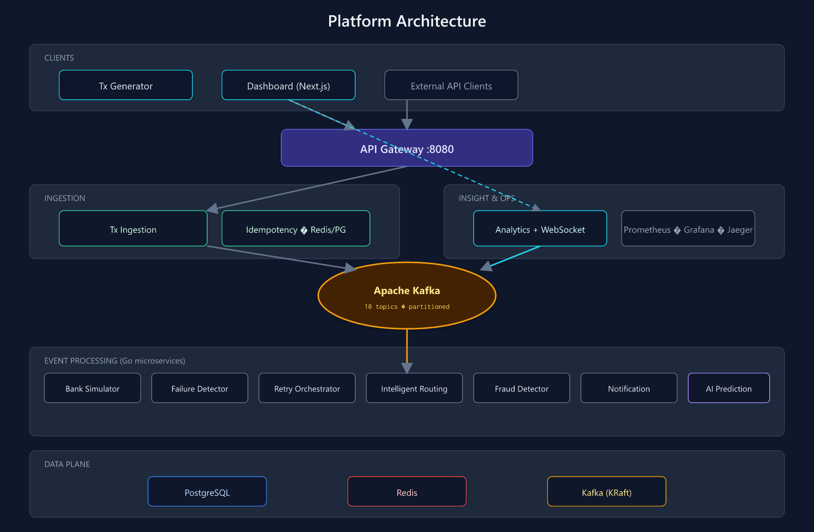
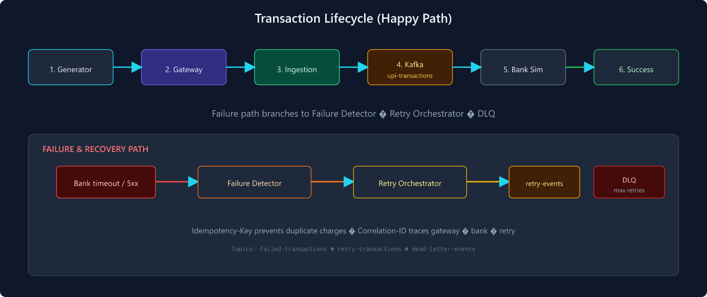

# UPI Transaction Intelligence & Failure Recovery Platform

[](LICENSE)


A **production-style**, event-driven platform that simulates **UPI-scale payment traffic** with realistic bank failures, automated retry orchestration, fraud detection, intelligent routing, and a real-time operations dashboard.

Built as a learning and portfolio system: Kafka pipelines, Go microservices, Next.js UI, full observability, Helm/K8s, load testing, and chaos engineering.

<p align="center">
  
</p>
<p align="center">
  
</p>
<p align="center">
  
</p>
<p align="center">
  
</p>
<p align="center"><em>Operations dashboard — live TPS, bank health, retries, and event stream</em></p>

---

## Features

- **High-volume ingestion** — API gateway, idempotency (Redis + Postgres), async Kafka publish
- **Transaction lifecycle** — validate → bank simulate → success/fail → retry/DLQ
- **Failure intelligence** — classify failures, exponential backoff retries, dead-letter handling
- **Smart routing** — congestion signals from latency and bank health events
- **Fraud detection** — amount/outlier alerts on validated transactions
- **Live operations** — Next.js dashboard with WebSocket metrics stream
- **Observability** — Prometheus, Grafana, Jaeger, OpenTelemetry
- **Deployable** — Docker Compose, Helm chart, Terraform, kind scripts
- **Resilience testing** — k6 load suites and chaos scripts (Kafka outage, service kill)

---

## Architecture

<p align="center">
  
</p>

<p align="center">
  
</p>

| Layer | Components |
|-------|------------|
| Ingestion | API Gateway, Tx Ingestion, Tx Generator |
| Processing | Bank Simulator, Failure Detector, Retry Orchestrator |
| Intelligence | Intelligent Routing, Fraud Detector, AI Prediction |
| Insight | Analytics, Notification, Dashboard |

Deep dive: [docs/architecture/](docs/architecture/README.md) · [Kafka topics](docs/kafka/topics.md) · [ADRs](docs/adr/README.md)

---


## Tech stack

| Area | Stack |
|------|--------|
| Services | Go 1.22+ microservices, Python FastAPI (AI) |
| Messaging | Apache Kafka (KRaft) |
| Data | PostgreSQL, Redis |
| API | REST, OpenAPI contracts in `shared/contracts/` |
| Frontend | Next.js 14, Tailwind, Recharts |
| Observability | Prometheus, Grafana, Jaeger, OTel Collector |
| Deploy | Docker Compose, Helm 3, Terraform, kind |
| Testing | k6 load tests, chaos scripts |

---


## Quick start (local development)

Clone the repo, open PowerShell at the project root, then:

```powershell
# 1. Start infrastructure (Kafka, Postgres on :5433, Redis, Grafana, Jaeger)
.\scripts\dev\bootstrap.ps1

# 2. Build Go services → .\bin\
.\scripts\dev\build-all.ps1

# 3. Start all microservices (logs in .\logs\)
.\scripts\dev\run-services.ps1

# 4. Dashboard — new terminal
.\scripts\dev\run-dashboard.ps1

# 5. Generate traffic
.\scripts\dev\start-generator.ps1
```

**One-liner** (infra + build + services only):

```powershell
.\scripts\dev\start-all.ps1
```

### Service URLs

| Service | URL | Notes |
|---------|-----|--------|
| Dashboard | http://localhost:3000 | Live metrics WebSocket |
| API Gateway | http://localhost:8080 | Header: `Authorization: Bearer dev-api-key-001` |
| Analytics | http://localhost:8089 | `/v1/dashboard`, `/v1/ws/live` |
| Tx Generator | http://localhost:8082 | Traffic control API |
| Grafana | http://localhost:3001 | `admin` / `admin` |
| Kafka UI | http://localhost:8088 | Topic inspection |
| Jaeger | http://localhost:16686 | Distributed traces |
| Prometheus | http://localhost:9090 | Metrics |

### Stop

```powershell
.\scripts\dev\stop-services.ps1
docker compose down
```

Full setup, troubleshooting, and optional tools: **[SETUP.md](SETUP.md)**

---

## Microservices

| Service | Port | Role |
|---------|------|------|
| API Gateway | 8080 | Auth, rate limit, route to ingestion |
| Tx Ingestion | 8081 | Validate, idempotency, publish to Kafka |
| Tx Generator | 8082 | Synthetic UPI traffic |
| Bank Simulator | 8083 | Latency, failures, bank overload |
| Failure Detector | 8084 | Classify failed transactions |
| Retry Orchestrator | 8085 | Backoff retries, DLQ |
| Intelligent Routing | 8086 | Congestion-aware routing signals |
| Fraud Detector | 8087 | Anomaly alerts |
| Analytics | 8089 | Aggregates, dashboard API, WebSocket |
| Notification | 8090 | Alert dispatch |
| AI Prediction | 8091 | Traffic/congestion forecast (Python) |
| Dashboard | 3000 | Next.js operations UI |


---

## Load & chaos testing

```powershell
# Requires running services
.\load-tests\run-benchmark.ps1 -Test baseline
.\load-tests\run-benchmark.ps1 -Test all

.\scripts\chaos\kafka-outage.ps1
.\scripts\chaos\kill-service.ps1 -ServiceName bank-simulator
```

Results: `load-tests/results/` · Details: [docs/PHASE6_SUMMARY.md](docs/PHASE6_SUMMARY.md)

---

## Repository structure

```
upi/
├── apps/dashboard/          # Next.js operations UI
├── services/                # Go microservices + ai-prediction (Python)
├── shared/
│   ├── contracts/           # OpenAPI, AsyncAPI, JSON Schema
│   └── go/                  # Shared libraries (kafka, config, httpx, …)
├── helm/upi-platform/       # Kubernetes Helm chart
├── terraform/               # Terraform modules (Helm release)
├── infra/
│   ├── database/migrations/ # PostgreSQL schema
│   └── docker/              # Dockerfiles
├── load-tests/k6/           # Performance test scripts
├── monitoring/              # Prometheus, Grafana, OTel configs
├── scripts/
│   ├── dev/                 # bootstrap, build, run, verify
│   ├── deploy/              # docker-compose deploy
│   ├── k8s/                 # kind, Helm, images
│   ├── kafka/               # topic creation
│   └── chaos/               # failure injection
├── docs/
│   ├── images/              # Architecture SVGs & screenshots
│   ├── architecture/        # Design docs
│   └── runbooks/            # Ops guides
├── docker-compose.yml       # Infra stack
└── docker-compose.apps.yml  # App services overlay
```

---

## Documentation

| Document | Description |
|----------|-------------|
| [SETUP.md](SETUP.md) | Install, run, test, troubleshoot |
| [docs/runbooks/deployment.md](docs/runbooks/deployment.md) | Compose, K8s, cloud deploy |
| [docs/runbooks/local-infra.md](docs/runbooks/local-infra.md) | Docker infra operations |
| [docs/architecture/](docs/architecture/README.md) | System design, data flow, security |
| [docs/kafka/topics.md](docs/kafka/topics.md) | Topic design and partitioning |
| [docs/adr/](docs/adr/README.md) | Architecture decision records |
| [docs/api/SERVICE_MATRIX.md](docs/api/SERVICE_MATRIX.md) | API surface per service |


---

## Health checks

```powershell
.\scripts\dev\verify-services.ps1
```

Each service exposes `GET /health/live` and `GET /health/ready`.

---

