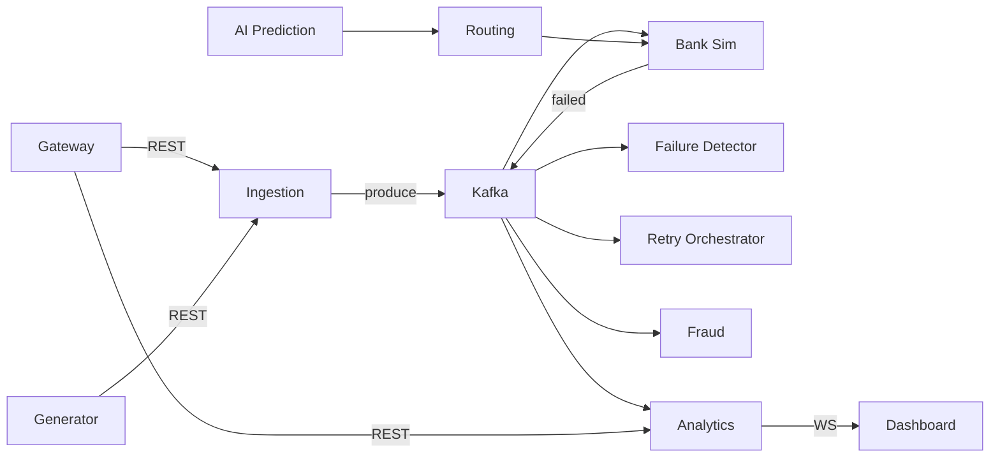

# Service Responsibility Matrix

| # | Service | Language | Ingress | Kafka Role | Data Stores |
|---|---------|----------|---------|------------|-------------|
| 1 | API Gateway | Go | HTTP :8080 | — | Redis (rate limit) |
| 2 | Tx Generator | Go | HTTP :8082 | Producer (via Ingestion) | — |
| 3 | Tx Ingestion | Go | HTTP :8081 | Producer | PG, Redis |
| 4 | Bank Simulator | Go | HTTP :8083 | Consumer + Producer | — |
| 5 | Failure Detector | Go | — | Consumer + Producer | — |
| 6 | Retry Orchestrator | Go | HTTP :8085 | Consumer + Producer | PG, Redis |
| 7 | Intelligent Routing | Go | — | Consumer + Producer | Redis |
| 8 | Fraud Detector | Go | — | Consumer + Producer | PG |
| 9 | Analytics | Go | HTTP/WS :8089 | Consumer | PG, Redis |
| 10 | AI Prediction | Python | HTTP :8091 | Consumer + Producer | PG (features) |
| 11 | Notification | Go | HTTP :8090 | Consumer | PG |
| 12 | Dashboard | Next.js | :3000 | — | — (via Analytics) |

## Inter-service communication

## Phase 3 implementation order

1. Tx Ingestion + shared Kafka client
2. Bank Simulator
3. Failure Detector + Retry Orchestrator
4. Analytics + Gateway proxy
5. Intelligent Routing + Fraud
6. Tx Generator
7. Notification + AI Prediction
8. Dashboard (Phase 4)
