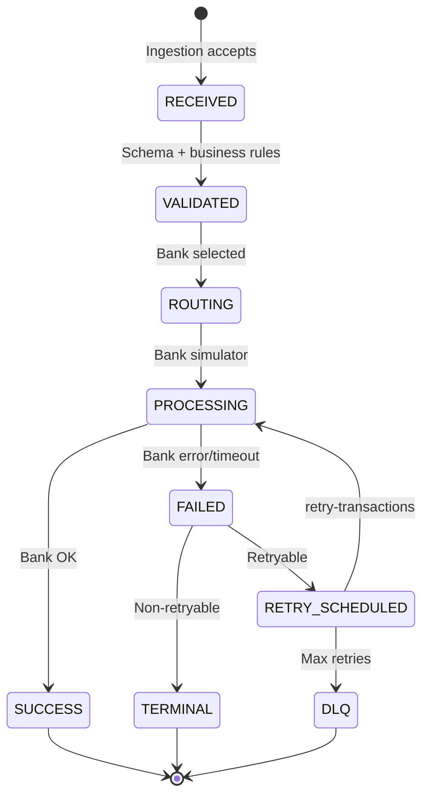

# Data Flow & State Machine


## Transaction lifecycle states



## Topic pipeline (primary path)

```
Tx Generator / External Client
        │
        ▼
   [Tx Ingestion] ──► upi-transactions (raw audit)
        │
        ▼
   validated-transactions
        │
        ▼
   [Bank Simulator] ──► latency-events
        │              └──► bank-health (side channel)
        ├── SUCCESS ──► analytics-events
        └── FAIL ──► failed-transactions
                        │
                        ▼
              [Failure Detector] (enrich failure_cause)
                        │
                        ▼
              [Retry Orchestrator]
                        │
            ┌───────────┴───────────┐
            ▼                       ▼
    retry-transactions      dead-letter-events
            │
            └──► (loop back to Bank Simulator via routing)

Parallel paths:
  validated-transactions ──► [Fraud Detector] ──► fraud-alerts
  metrics aggregation ──► congestion-events (from Routing + Analytics)
  all services ──► latency-events / analytics-events (observability)
```

## Partition key strategy

| Topic | Key | Rationale |
|-------|-----|-----------|
| `upi-transactions` | `payer_vpa` | Order per payer wallet |
| `validated-transactions` | `transaction_id` | Even fan-out to bank workers |
| `failed-transactions` | `transaction_id` | Retry state colocation |
| `retry-transactions` | `transaction_id` | Same retry chain partition |
| `bank-health` | `bank_code` | One partition per bank for health |
| `congestion-events` | `bank_code` | Congestion signals per bank |
| `fraud-alerts` | `merchant_id` | Merchant-centric fraud review |

## Event envelope (all Kafka messages)

Every payload is wrapped:

```json
{
  "event_id": "uuid",
  "event_type": "transaction.validated",
  "event_version": "1.0",
  "occurred_at": "2026-05-24T10:00:00Z",
  "correlation_id": "uuid",
  "trace_id": "hex",
  "source_service": "tx-ingestion",
  "payload": { }
}
```

Schema: `shared/contracts/schemas/event-envelope.json`

## Idempotency flow

1. Client sends `Idempotency-Key` header (or body field).
2. Ingestion: `SET idempotency:{key} NX EX 86400` in Redis.
3. On duplicate: return `409` with original `transaction_id`.
4. Retry Orchestrator: checks `retry_idempotency:{txn_id}:{attempt}` before publish.
5. Postgres `idempotency_records` table for durable audit.

## Read models (CQRS-lite)

| Read model | Writer | Reader |
|------------|--------|--------|
| `transaction_summary` | Analytics | Dashboard REST |
| `bank_health_snapshot` | Analytics | Dashboard cards |
| `retry_queue_depth` | Retry Orchestrator | Dashboard + Prometheus |
| `fraud_alert_feed` | Fraud Detector | Dashboard |

PostgreSQL schemas: `infra/database/migrations/` (Phase 2).
