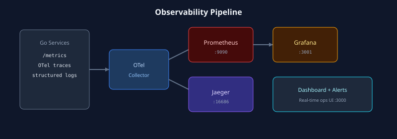
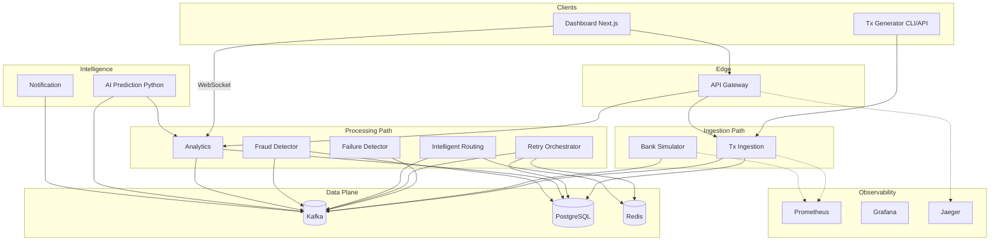
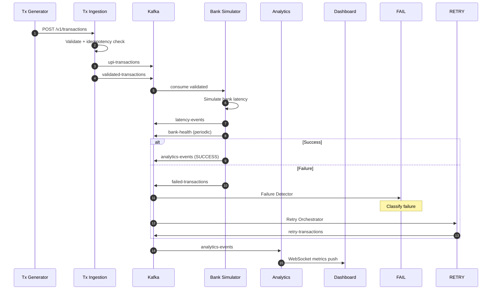
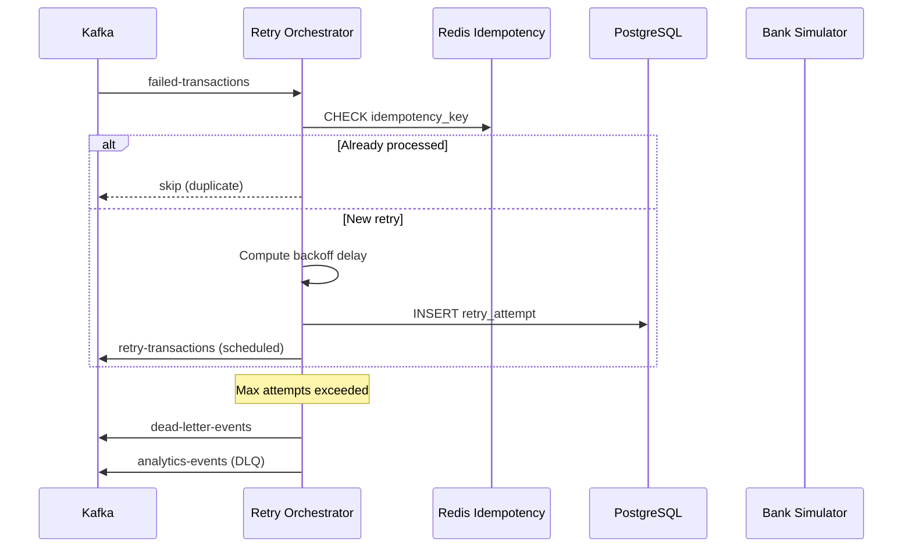
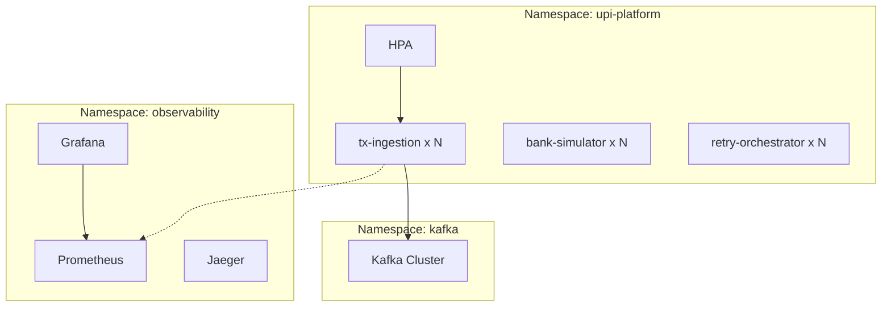
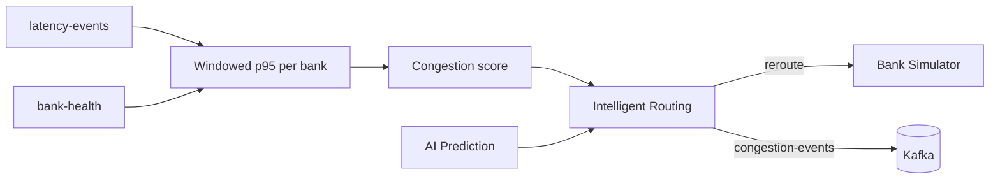

# Architecture Diagrams

Static diagrams (render on GitHub without Mermaid):

| Diagram | Image |
|---------|-------|
| Platform overview |  |
| Transaction flow |  |
| Deployment options |  |
| Observability |  |
| Dashboard UI |  |

Full set: [docs/images/README.md](../images/README.md)

---

## Container diagram (C4)

## Happy-path sequence

## Retry & DLQ sequence

## Deployment view (Kubernetes)

## Congestion & routing decision

