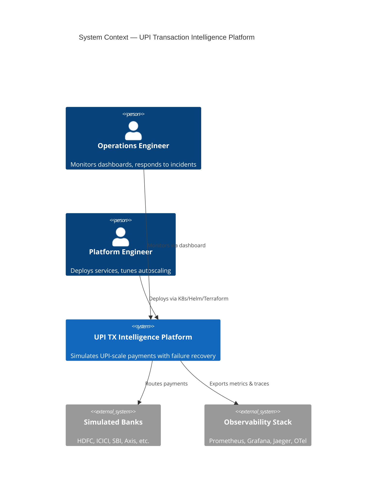

# System Overview

## Problem statement

UPI-scale payment networks process **billions** of transactions daily. Failures are inevitable: bank timeouts, NPCI switch congestion, issuer downtime, and client retries create **duplicate risk**, **retry storms**, and **cascading overload**. Operations teams need **real-time visibility**, **automated recovery**, and **predictive routing**—not batch reconciliation after the fact.

This platform **simulates** that infrastructure at enterprise fidelity: high TPS generators, Kafka-backed lifecycle events, bank simulators with configurable failure modes, intelligent retry orchestration, congestion-aware routing, ML-based traffic prediction, and full observability.

## Logical architecture (C4 Context)

## Core capabilities

| Capability | Implementation surface |
|------------|-------------------------|
| High-volume ingestion | Tx Generator → Ingestion → `upi-transactions` |
| Validation & enrichment | Ingestion → `validated-transactions` |
| Bank processing | Bank Simulator (latency, failure, overload) |
| Failure classification | Failure Detector → `failed-transactions` |
| Recovery | Retry Orchestrator (backoff, DLQ, idempotency) |
| Smart routing | Intelligent Routing (congestion, reroute) |
| Risk | Fraud Detector → `fraud-alerts` |
| Metrics | Analytics → aggregates, API for dashboard |
| Prediction | AI Service (congestion/traffic forecast) |
| Alerting | Notification Service |
| Operations UI | Next.js dashboard (WebSocket live stream) |

## Consistency model

| Data | Consistency | Notes |
|------|-------------|-------|
| Kafka events | Ordering per partition key (`payer_vpa` hash) | Per-payer ordering for retry safety |
| Idempotency | Strong per `idempotency_key` | Redis SET NX + TTL; Postgres audit |
| Analytics aggregates | Eventual | Windowed from `analytics-events` |
| Bank health | Eventual | Derived from `bank-health`, `latency-events` |
| Dashboard live view | Best-effort | WebSocket fan-out from Analytics |

## Correlation & tracing

Every external request receives:

- `X-Request-Id` (UUID v4)
- `X-Correlation-Id` (propagated across services)
- `traceparent` (W3C Trace Context via OpenTelemetry)

Kafka message headers mirror HTTP headers for end-to-end Jaeger traces.

## Failure taxonomy

| Code | Category | Retryable | Example |
|------|----------|-----------|---------|
| `BANK_TIMEOUT` | Infrastructure | Yes | PSP timeout |
| `BANK_OVERLOAD` | Congestion | Yes (routed) | 503 from simulator |
| `INSUFFICIENT_FUNDS` | Business | No | Decline |
| `INVALID_VPA` | Validation | No | Bad payer VPA |
| `DUPLICATE_TXN` | Idempotency | No | Replay blocked |
| `FRAUD_SUSPECT` | Risk | No | High anomaly score |
| `NPCI_SWITCH_DOWN` | Catastrophic | Yes (delayed) | Circuit open |

## Non-goals (simulation boundaries)

- Real NPCI/UPI network integration
- PCI-DSS certified HSM key management (simulated auth only)
- Production financial settlement

## Related documents

- [diagrams.md](./diagrams.md) — deployment and sequence views
- [data-flow.md](./data-flow.md) — topic-level flows
- [resilience.md](./resilience.md) — recovery patterns
- [../kafka/topics.md](../kafka/topics.md) — topic catalog
